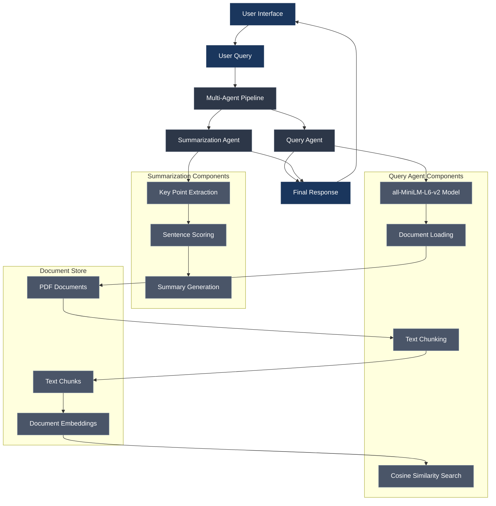
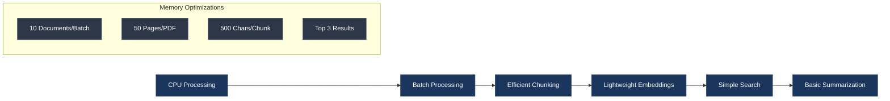
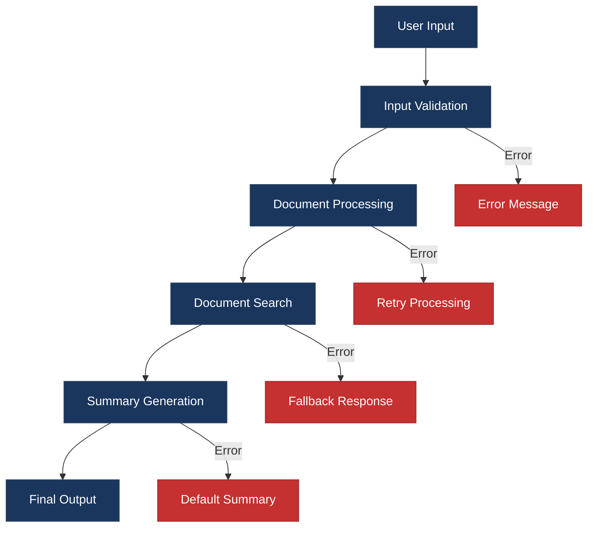

# Simple Legal Assistant - Architecture

## System Overview

## Workflow Description

### 1. User Interaction
- User submits a query through the Gradio interface
- Query is passed to the Multi-Agent Pipeline

### 2. Query Agent Processing
1. **Document Loading**
   - Loads PDF documents (max 50 pages each)
   - Processes documents in batches of 10
   - Shows progress with emoji indicators

2. **Text Chunking**
   - Splits text into 500-character chunks
   - Uses sentence boundaries
   - Maintains readability

3. **Search Process**
   - Uses all-MiniLM-L6-v2 for embeddings
   - Performs cosine similarity search
   - Returns top 3 relevant chunks

### 3. Summarization Agent Processing
1. **Key Point Extraction**
   - Analyzes retrieved chunks
   - Identifies important sentences
   - Considers sentence length and position

2. **Sentence Scoring**
   - Scores based on keyword matches
   - Considers sentence length
   - Combines multiple scoring factors

3. **Summary Generation**
   - Selects top 4 sentences
   - Maintains coherence
   - Formats response

### 4. Response Generation
- Combines search results and summary
- Formats for user readability
- Returns through Gradio interface

## Memory Optimization

## Error Handling

## Performance Metrics

- **Memory Usage**: ~4GB RAM
- **Processing Time**: < 2 minutes
- **Response Time**: < 5 seconds
- **Document Limit**: 50 pages per PDF
- **Batch Size**: 10 documents
- **Chunk Size**: 500 characters
- **Top Results**: 3 chunks
- **Summary Length**: 4 sentences 