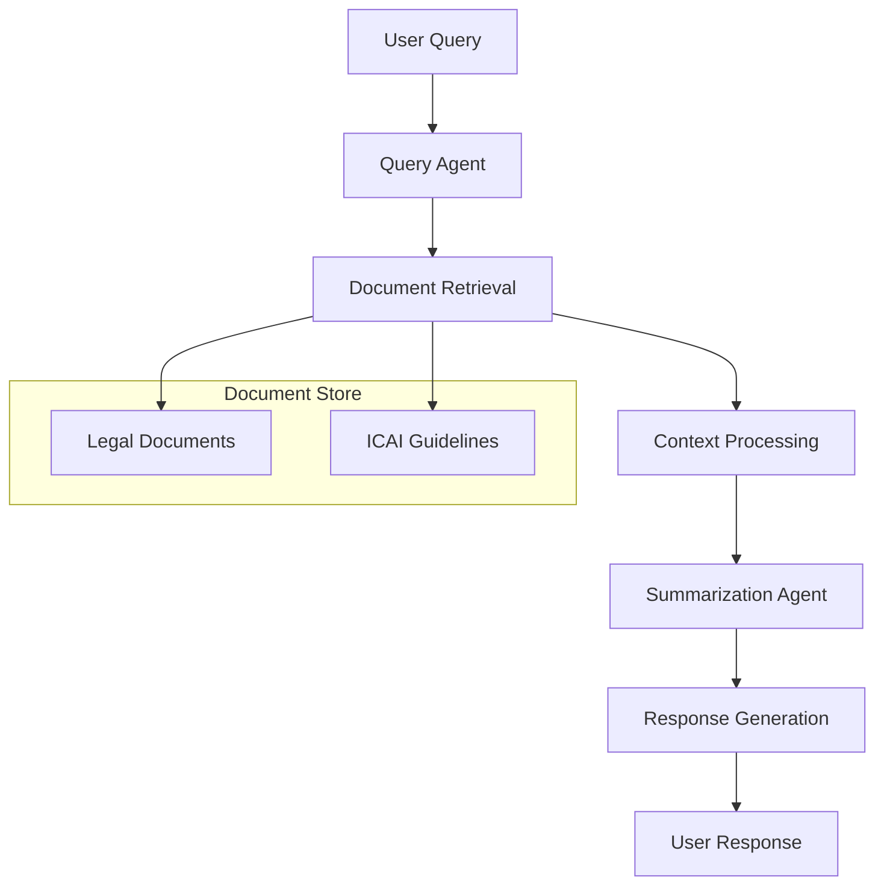

# RAG Architecture Documentation

## Overview

The Indian Legal & Accounting Assistant uses a Retrieval-Augmented Generation (RAG) architecture to provide accurate and contextually relevant responses to legal queries. This document outlines the system's architecture and workflow.

## System Architecture

## Components

### 1. Query Agent
- **Purpose**: Processes and understands user queries
- **Functionality**:
  - Query parsing and intent recognition
  - Context extraction
  - Query optimization for retrieval

### 2. Document Retrieval
- **Purpose**: Finds relevant information from legal documents
- **Technologies**:
  - FAISS for efficient similarity search
  - Sentence transformers for semantic matching
- **Process**:
  1. Convert query to vector representation
  2. Search document embeddings
  3. Retrieve most relevant passages

### 3. Context Processing
- **Purpose**: Analyzes and prepares retrieved information
- **Functionality**:
  - Context window management
  - Relevance scoring
  - Information aggregation

### 4. Summarization Agent
- **Purpose**: Simplifies complex legal information
- **Technologies**:
  - T5 model for text generation
  - Custom prompt engineering
- **Process**:
  1. Analyze retrieved context
  2. Generate simplified explanation
  3. Format response appropriately

## Data Flow

1. **Input Processing**
   - User submits query
   - Query Agent processes and optimizes

2. **Information Retrieval**
   - Search through document embeddings
   - Retrieve relevant passages
   - Score and rank results

3. **Response Generation**
   - Process retrieved information
   - Generate simplified explanation
   - Format final response

## Performance Optimizations

1. **Caching**
   - LRU cache for frequent queries
   - Response caching for similar questions

2. **Model Optimization**
   - Half-precision inference
   - Batch processing
   - GPU acceleration when available

3. **Memory Management**
   - Efficient document chunking
   - Context window optimization
   - Resource-aware processing

## Security Considerations

1. **Data Protection**
   - Secure document storage
   - Access control implementation
   - Data encryption

2. **Input Validation**
   - Query sanitization
   - Rate limiting
   - Error handling

## Monitoring and Maintenance

1. **Performance Metrics**
   - Response time tracking
   - Accuracy monitoring
   - Resource utilization

2. **System Health**
   - Error logging
   - Performance alerts
   - Regular maintenance

## Future Improvements

1. **Planned Enhancements**
   - Multi-document reasoning
   - Enhanced context understanding
   - Improved response quality

2. **Scalability**
   - Distributed processing
   - Load balancing
   - Horizontal scaling 