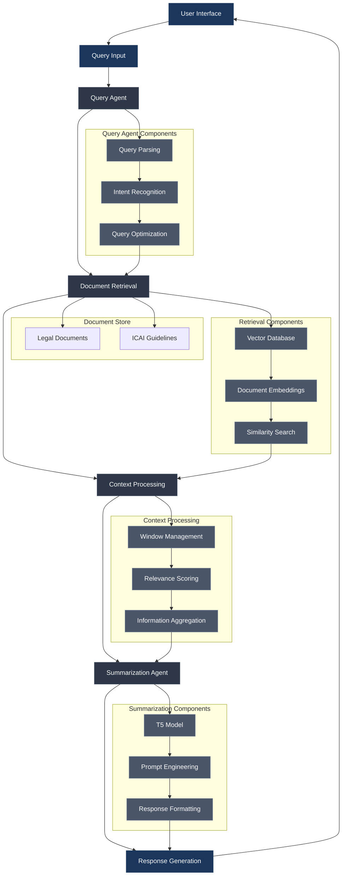

# RAG Architecture Diagram

## System Overview

## How to Preview

1. Open this file in VS Code
2. Press `Ctrl+Shift+V` (Windows/Linux) or `Cmd+Shift+V` (Mac) to open the preview
3. The diagram will be rendered automatically

## Alternative Preview Methods

1. **Using Mermaid Preview Extension**:
   - Right-click on the file
   - Select "Open Preview to the Side"
   - The diagram will be rendered in real-time

2. **Using Command Palette**:
   - Press `Ctrl+Shift+P` (Windows/Linux) or `Cmd+Shift+P` (Mac)
   - Type "Markdown: Open Preview"
   - Select the option to open preview

## Export Options

Once you're happy with the diagram, you can:
1. Use the Mermaid Live Editor (https://mermaid.live) to export as PNG/SVG
2. Use the "Mermaid Preview" extension's export feature
3. Take a screenshot of the preview 